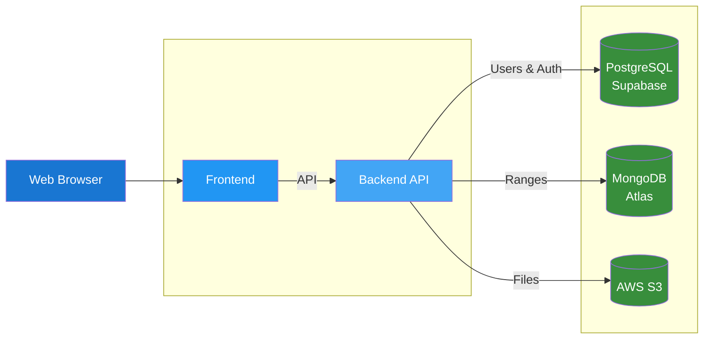

# Texas Poker Application

A full-stack poker application with range analysis and visualization tools, featuring an interactive range builder, user authentication, and file management.

## Prerequisites

Before getting started, ensure you have the following installed:

- **Node.js** 16+ 
- **Docker** and **Docker Compose**
- **Git**

For production deployment, you'll also need:
- **AWS CLI** configured

## 🚀 Quick Start

### 1. Clone the repository

```bash
git clone <repository-url>
cd texas
```

### 2. Start all services

```bash
docker-compose up
```

**Note:** Docker will automatically install dependencies and build the services. No local npm install required.

### 3. Verify the setup

Once the services are running, verify everything is working:

- **Frontend**: Open [http://localhost:8080](http://localhost:8080) in your browser
- **Backend API**: Check [http://localhost:3000/api](http://localhost:3000/api) for Swagger documentation
- **Health Check**: Visit [http://localhost:3000/health](http://localhost:3000/health) to verify backend status

### Environment Configuration

Environment variables are configured via `.env` files in each service directory:
- `apps/frontend/.env` - Frontend configuration
- `apps/backend/.development.env` - Backend API configuration (uses `.${NODE_ENV}.env` format)

### Need help?
See [CONTRIBUTING.md](CONTRIBUTING.md) for detailed setup instructions or [Troubleshooting Guide](docs/troubleshooting.md) if you encounter issues.

## 🏗️ Architecture

### Project Structure

```
├── apps/
│   ├── frontend/      # React frontend
│   └── backend/       # NestJS API
├── infrastructure/    # AWS deployment configuration
└── tools/             # Development tools
```

### System Overview

The application follows a **two-service architecture** with a unified backend API:



For detailed architecture information, see [System Architecture](docs/architecture.md).

### 🤖 AI-Assisted Development

This project includes AI tooling for enhanced development:

- **MCP Server**: Provides Claude with automatic access to project context. See [tools/texas-mcp-server/](tools/texas-mcp-server/) and `.cursor/mcp.json` for configuration.

## 📚 Documentation

- **[Contributing Guide](CONTRIBUTING.md)** - Development setup, workflow, and standards
- **[Changelog](CHANGELOG.md)** - Version history and release notes
- **[System Architecture](docs/architecture.md)** - Technical design and component interactions
- **[Infrastructure Guide](infrastructure/README.md)** - Production deployment on AWS
- **[Troubleshooting Guide](docs/troubleshooting.md)** - Common issues and solutions

### Service-Specific Documentation
- [Frontend (apps/frontend/)](apps/frontend/README.md) - React app architecture
- [Backend API (apps/backend/)](apps/backend/README.md) - NestJS backend service

### API Documentation
- [Backend API](http://localhost:3000/api) - Interactive Swagger docs

## 🛠️ Tech Stack

**Frontend**: React + TypeScript + Material-UI + Redux Toolkit
**Backend**: NestJS + TypeScript
**Databases**: PostgreSQL (Supabase) + MongoDB Atlas
**Infrastructure**: AWS + Docker + Terraform  

## 📄 License

MIT License
