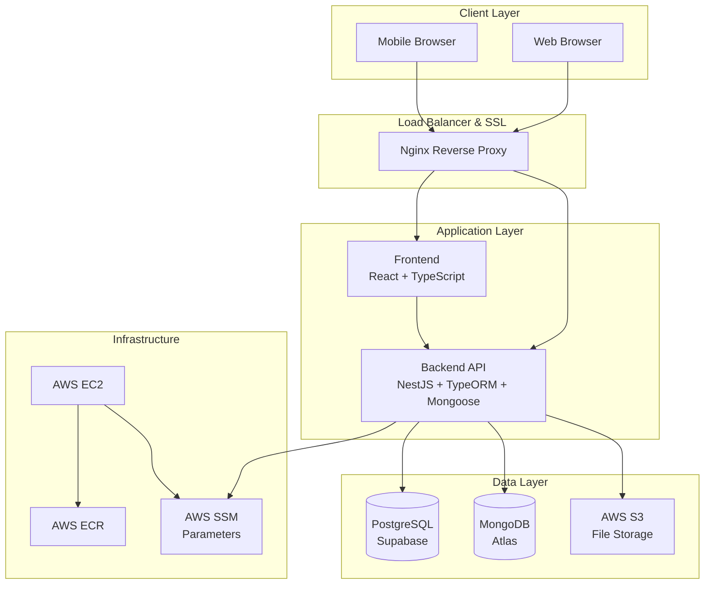
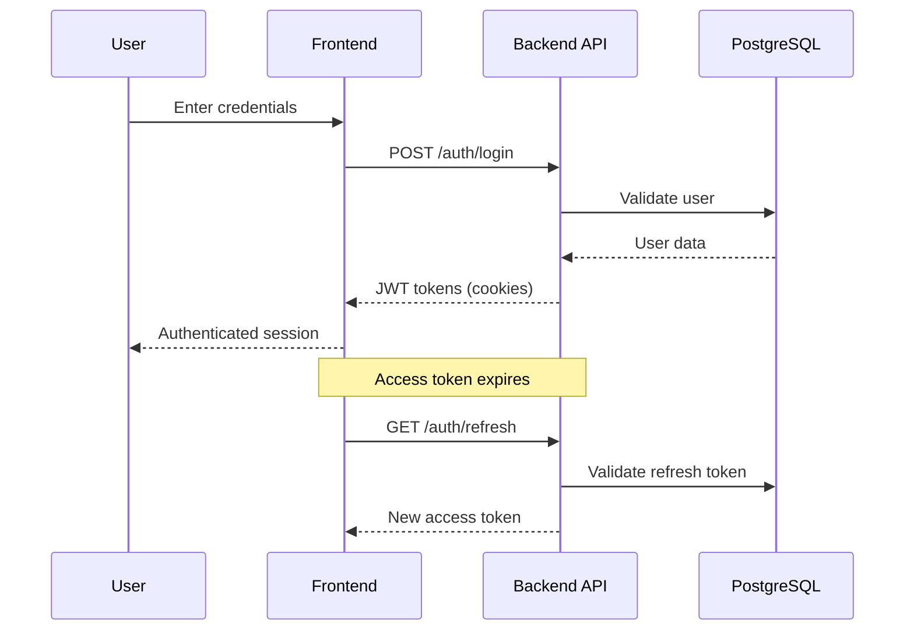
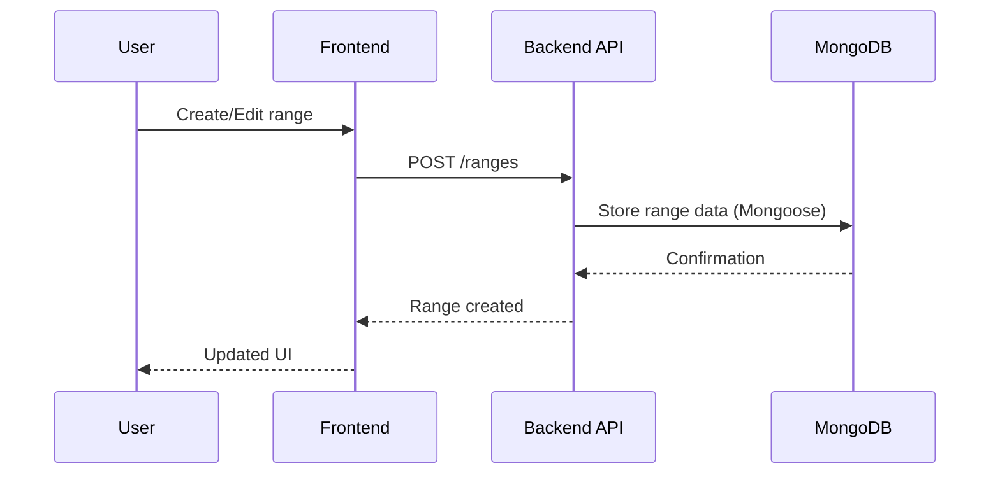

# System Architecture

This document provides a high-level overview of the Texas Poker application architecture, explaining how the different components interact and the design decisions behind the system.

## 🏗️ High-Level Architecture

## 🔧 Component Breakdown

### Frontend Layer

#### Frontend (React Application)

- **Technology**: React 18 + TypeScript + Material-UI
- **Purpose**: User interface for poker range analysis
- **Key Features**:
  - Interactive poker range builder (13x13 grid)
  - User authentication and registration
  - File upload and management
  - Dark/light theme switching
- **State Management**: Redux Toolkit
- **Build Tool**: Webpack 5
- **Testing**: Jest + React Testing Library

### API Layer

#### Backend (Unified NestJS Service)

- **Technology**: NestJS + TypeScript + PostgreSQL + MongoDB
- **Purpose**: User management, authentication, file handling, and poker range analysis
- **Key Features**:
  - JWT-based authentication with refresh tokens
  - User registration and email verification
  - Password reset functionality
  - File upload to AWS S3
  - Email notifications via AWS SES
  - Poker range CRUD operations and analysis
  - User-specific range isolation
  - Complex range data structures with validation
- **Databases**:
  - PostgreSQL (Supabase) with TypeORM for user/auth data
  - MongoDB Atlas with Mongoose for range data
- **Authentication**: Passport.js with JWT strategy

### Data Layer

#### PostgreSQL (User Database)

- **Provider**: Supabase (managed PostgreSQL)
- **Purpose**: User accounts, authentication data, file metadata
- **Schema**:
  - Users table (authentication, profile data)
  - Files table (uploaded file metadata)
  - Refresh tokens (session management)

#### MongoDB (Range Database)

- **Provider**: MongoDB Atlas (free tier)
- **Purpose**: Poker range data storage
- **Collections**:
  - Ranges (poker hand ranges with actions)
  - User-specific range isolation
- **Integration**: Mongoose ODM in Backend service

#### AWS S3 (File Storage)

- **Purpose**: User-uploaded files storage
- **Configuration**: Public read access for certain files
- **Integration**: Direct upload from Backend API

## 🔄 Data Flow Patterns

### Authentication Flow

### Range Management Flow

## 🏭 Deployment Architecture

### Environment Overview

- **Development**: Docker Compose with local databases
- **Production**: AWS EC2 with Nginx reverse proxy

For detailed deployment instructions, see [infrastructure/README.md](../infrastructure/README.md)

## 🔐 Security Architecture

### Authentication & Authorization

- **JWT Tokens**: Short-lived access tokens (1 hour)
- **Refresh Tokens**: Longer-lived refresh tokens (5 hours)
- **Cookie-based**: HTTP-only, secure cookies
- **CSRF Protection**: SameSite cookie attributes

### Data Protection

- **Password Security**: bcrypt hashing with salt
- **HTTPS**: End-to-end encryption via Let's Encrypt
- **CORS**: Configured for specific origins
- **Input Validation**: Comprehensive validation on all inputs

### Infrastructure Security

- **IAM**: Least-privilege access policies
- **Security Groups**: Restrictive inbound rules (80/443 only)
- **Secrets Management**: AWS SSM Parameter Store
- **Network Isolation**: Private networking for databases

## 📡 API Design Patterns

### RESTful Architecture

- **Standard HTTP methods**: GET, POST, PUT, DELETE
- **Resource-based URLs**: `/users`, `/ranges`, `/files`
- **HTTP status codes**: Proper status code usage
- **Content negotiation**: JSON request/response format

### Error Handling

- **Consistent format**: Standardized error response structure
- **Proper status codes**: 4xx for client errors, 5xx for server errors
- **Detailed messages**: Clear error descriptions for debugging
- **Validation errors**: Field-specific validation feedback

### API Versioning

- **URL versioning**: `/api/v1/` prefix where applicable
- **Backward compatibility**: Maintain compatibility when possible
- **Documentation**: OpenAPI/Swagger specifications

## 🔄 State Management Patterns

### Frontend State (Redux Toolkit)

- **Slices**: Feature-based state organization
- **Async Thunks**: Standardized async operations
- **Middleware**: Automatic token refresh interceptors
- **Persistence**: Local storage for theme preferences

### Backend State

- **Stateless services**: No server-side session storage
- **Database transactions**: ACID compliance where needed
- **Caching**: Connection pooling and query optimization

## 📊 Monitoring & Observability

### Application Monitoring

- **Health checks**: `/health` endpoints on all services
- **Logging**: Structured JSON logging
- **Error tracking**: Centralized error handling

### Infrastructure Monitoring

- **Docker logs**: Container-level logging
- **Nginx logs**: Access and error logs
- **System metrics**: CPU, memory, disk usage via Docker stats

## 🚀 Scalability Considerations

### Current Limitations

- **Single instance**: All services on one EC2 instance
- **Database bottlenecks**: Single database connections
- **File storage**: S3 dependency for file operations

### Future Scaling Options

- **Horizontal scaling**: Multiple EC2 instances with load balancing
- **Database scaling**: Read replicas and connection pooling
- **CDN integration**: CloudFront for static assets
- **Microservice separation**: Independent deployment of services

## 🔧 Development Architecture

- **Hot reload**: All services support live code reloading
- **API mocking**: MSW (Mock Service Worker) for frontend development
- **Database migrations**: Automatic schema updates via TypeORM
- **Testing isolation**: Separate test databases and environments

For detailed development workflow, see [CONTRIBUTING.md](../CONTRIBUTING.md)

## 📚 Technology Stack Rationale

### Frontend: React + TypeScript

- **Pros**: Strong typing, large ecosystem, excellent tooling
- **Use case**: Complex UI with real-time updates
- **Alternatives considered**: Vue.js, Angular

### Backend: NestJS

- **Pros**: Mature framework, excellent TypeScript support, modular architecture
- **Use case**: Unified backend handling authentication, files, and domain logic
- **Alternatives considered**: Express.js, Fastify, Spring Boot

### Databases: PostgreSQL + MongoDB

- **PostgreSQL**: ACID compliance for user data
- **MongoDB**: Flexible schema for complex range structures
- **Alternatives considered**: Single database solution

### Infrastructure: AWS

- **Pros**: Comprehensive service offerings, mature tooling
- **Use case**: Small to medium scale application
- **Alternatives considered**: GCP, Azure, self-hosted
