# MVP: Scenario-Based Poker Range Calculator

**Status:** Planning Phase  
**Target User:** Poker players learning GTO theory through practice  
**Last Updated:** October 31, 2025

---

## Table of Contents

1. [Vision & Goals](#vision--goals)
2. [Problem Statement](#problem-statement)
3. [MVP Scope](#mvp-scope)
4. [User Journey](#user-journey)
5. [Current State Analysis](#current-state-analysis)
6. [Data Models](#data-models)
7. [Required Features](#required-features)
8. [API Contracts](#api-contracts)
9. [MCP Server Integration](#mcp-server-integration)
10. [Implementation Phases](#implementation-phases)
11. [Success Metrics](#success-metrics)

---

## Vision & Goals

### The Big Picture
Build a unified platform for poker analysts that consolidates scattered tools into one cohesive system, with an MCP server enabling AI tool integration for programmatic access to poker analysis.

### MVP Focus
Create a **scenario-based range calculator** that helps poker players learn GTO theory through guided practice:
- Players build ranges for specific poker scenarios
- System compares their attempt against GTO solutions
- Players learn through immediate feedback and visual comparison
- AI tools can leverage the calculation engine via MCP server

### Why This Matters
Current poker study involves juggling multiple disconnected tools:
- Range builders (visualization)
- GTO solvers (calculations)
- Training sites (theory)
- Hand history analyzers (practice)

**The MVP solves:** Learning GTO ranges through interactive practice with a foundation for tool integration.

---

## Problem Statement

### User Pain Points
1. **Scattered Tools:** Poker analysts switch between 5+ different applications during study sessions
2. **Theory vs Practice Gap:** Reading GTO charts doesn't translate to internalized knowledge
3. **LLM Calculation Failures:** AI assistants understand poker strategy conceptually but fail at precise equity calculations, range math, and combinatorics
4. **No Programmatic Access:** Existing tools lack APIs for integration with modern AI workflows

### Target User
**Primary:** Self-improving poker player (beginner to intermediate)
- Wants to learn GTO fundamentals
- Struggles to memorize chart-based ranges
- Needs practice-based learning, not just theory
- May use AI tools for study assistance

---

## MVP Scope

### ✅ In Scope (Must-Have)
1. **Scenario Library:** Pre-defined common poker scenarios with context
2. **Reference Ranges:** GTO-solved ranges for each scenario (via TexasSolver)
3. **Range Comparison:** Visual diff between user's range and GTO solution
4. **Guided Learning:** Feedback on mistakes with explanations
5. **MCP Server:** Expose calculations to AI tools

### 🔮 Out of Scope (Post-MVP)
- Custom scenario builder
- Hand history integration
- Real-time solver integration
- Advanced multi-street scenarios
- Database/tracking tool integration
- ICM calculations
- Session tracking

### Fixed Constraints (MVP)
- **Bet Sizing:** Fixed standard sizes (2.5bb opens for cash, 2bb for tournaments, etc.)
- **Game Types:** Tournament preflop scenarios only (cash game post-MVP)
- **Decision Type:** Heads-up decisions only (multi-way scenarios post-MVP)
- **Table Structure:** 6-max positions (UTG, MP, CO, BTN, SB, BB) - 9-max post-MVP
- **Stack Depths:** Fixed depths per scenario (20bb, 40bb, 100bb)

---

## User Journey

### Learning Flow (Guided Discovery)

```mermaid
flowchart TD
    A[🎯 Select Scenario] --> B[📝 Build Your Range]
    B --> C[⚖️ Compare to GTO]
    C --> D[💡 Learn Why]
    D --> E{Want to Improve?}
    E -->|Try Again| B
    E -->|Next Scenario| A
    E -->|Done| F[✅ Progress Saved]
    
    style A fill:#e3f2fd
    style B fill:#fff3e0
    style C fill:#f3e5f5
    style D fill:#e8f5e9
    style F fill:#c8e6c9
```



**Step Details:**
1. **Select Scenario** - Choose from pre-defined poker situations (e.g., "BTN vs CO Open - Call Range")
2. **Build Range** - Use existing range builder to construct your attempt
3. **Compare to GTO** - System shows visual diff (correct/missing/extra hands)
4. **Learn Why** - Detailed feedback on mistakes with equity/playability explanations

---

## Current State Analysis

### What Already Exists ✅

#### Range Builder System (MongoDB)
**Location:** `apps/backend/src/ranges/`

The application already has a fully functional range management system:

**Existing Features:**
- ✅ Create, read, update, delete ranges
- ✅ User authentication and ownership
- ✅ Range persistence in MongoDB
- ✅ Support for mixed strategies (action frequencies)
- ✅ Visual range builder UI in frontend

**Existing API Endpoints:**
```typescript
POST   /ranges              // Create new range
GET    /ranges/user/:userId // Get all user's ranges
GET    /ranges/:id          // Get specific range
PUT    /ranges/:id          // Update range
DELETE /ranges/:id          // Delete range
```

**Current Limitations:**
- Max 10 ranges per user
- No scenario association
- No comparison functionality
- No reference/GTO ranges

---

## Data Models

### Existing Models (Do Not Modify)

#### Range Schema (MongoDB)
**Collection:** `ranges`  
**Location:** `apps/backend/src/ranges/schemas/range.schema.ts`

```typescript
interface Range {
  _id: ObjectId;           // MongoDB ID
  name: string;            // Unique range name
  userId: string;          // Owner (from auth system)
  handsRange: HandRange[]; // Array of hand specifications
  createdAt: Date;         // Auto-generated
  updatedAt: Date;         // Auto-generated
}
```

#### HandRange Schema
**Purpose:** Defines a single hand combination with actions  
**Location:** `apps/backend/src/ranges/schemas/hand-range.schema.ts`

```typescript
interface HandRange {
  carryoverFrequency: number;  // Combo frequency from previous street (0-100)
                               // Renamed from rangeFraction for clarity
                               // e.g., If AA was 3-bet 75% preflop, flop range has carryoverFrequency=75
                               // Enables post-flop scenarios with mixed strategy carryover
  label: string;              // Hand notation: "AA", "AKs", "AKo", "JTs", etc.
  actions: Action[];          // Array of possible actions with frequencies
}
```

**Important Note on `carryoverFrequency`:**
This field is critical for multi-street scenarios. When building post-flop ranges:
- Represents how much of this hand combo reached this street based on prior mixed strategies
- Example: If you 3-bet AA only 50% preflop, your flop range contains carryoverFrequency=50 for AA
- This matches GTO Wizard's hand capping in their range builders
- For preflop-only MVP, this will typically be 100 (all combos available)


#### Action Schema
**Purpose:** Define action types, frequencies, and GTO solver data  
**Location:** `apps/backend/src/ranges/schemas/action.schema.ts`

```typescript
interface Action {
  type: 'fold' | 'call' | 'raise' | 'check'; // ActionType enum
  frequency: number;                          // Frequency (0-100) - renamed from percentage
                                             // e.g., 75 = take this action 75% of the time
  
  // GTO Solver Data (from TexasSolver export)
  ev?: number;                                // Expected value (in big blinds)
  equity?: number;                            // Equity vs opponent's range (0-100)
}
```

**Example - Mixed Strategy with GTO Data:**
```typescript
{
  label: "AKo",
  carryoverFrequency: 100,  // All combos available (preflop scenario)
  actions: [
    { 
      type: "raise", 
      frequency: 70,        // 3-bet 70% of the time
      ev: 2.45,             // Expected value when 3-betting
      equity: 58.3          // Equity vs CO opening range
    },
    { 
      type: "call", 
      frequency: 30,        // Call 30% of the time
      ev: 1.82,             // Expected value when calling
      equity: 54.1          // Equity vs CO opening range
    }
  ]
}
```

**Notes:**
- `ev` and `equity` fields are optional - **NOT part of MVP**
- **MVP Decision:** EV/equity will be omitted from MVP. Strategy frequencies are sufficient for range comparison and learning features.
- **Future Enhancement (Post-MVP):** May fork TexasSolver and modify source code to export EV/equity data (see [GitHub Issue #202](https://github.com/bupticybee/TexasSolver/issues/202))
  - TexasSolver is open-source (AGPL v3), so source modification is possible
  - CFR solvers calculate EV during solving, so data may be available in memory
  - Would require C++ knowledge and maintaining a fork of TexasSolver
- User-built ranges won't have these fields until comparison with GTO reference ranges
- See `docs/texas-solver-integration.md` for detailed discussion on EV/equity options

---

### New Models Required

#### Data Model Relationships


#### Position Enum (New)
**Purpose:** Type-safe position definitions for 6-max poker  
**Location:** `apps/backend/src/ranges/schemas/position.enum.ts`

```typescript
enum Position {
  UTG = 'UTG',  // Under the Gun
  MP = 'MP',    // Middle Position
  CO = 'CO',    // Cutoff
  BTN = 'BTN',  // Button
  SB = 'SB',    // Small Blind
  BB = 'BB',    // Big Blind
}
```

**Future Consideration:** For 9-max tables, additional positions (UTG+1, UTG+2, MP1, MP2, etc.) can be added.

---

#### PreviousAction Type (New)
**Purpose:** Structured representation of actions taken before the current decision point  
**Location:** `apps/backend/src/ranges/schemas/previous-action.schema.ts`

```typescript
interface PreviousAction {
  position: Position;        // Which position took this action
  actionType: ActionType;    // 'fold' | 'call' | 'raise' | 'check'
  sizing?: number;           // Bet/raise size in big blinds (required for raises)
}
```

**Example:**
```typescript
previousActions: [
  { position: Position.UTG, actionType: ActionType.FOLD },
  { position: Position.MP, actionType: ActionType.FOLD },
  { position: Position.CO, actionType: ActionType.RAISE, sizing: 2.5 }
]
```

---

#### Scenario Schema (New - MongoDB)
**Collection:** `scenarios`  
**Purpose:** Define poker decision points for learning

```typescript
interface Scenario {
  _id: ObjectId;
  name: string;              // "BTN vs CO Open - Call Range"
  description: string;       // "CO opens 2.5bb at 100bb effective. You're on BTN. Build your calling range."
  
  // Scenario Context
  street: 'preflop' | 'flop' | 'turn' | 'river';
  gameType: 'cash' | 'tournament';
  position: Position;        // Hero position (MVP: heads-up only)
  vsPosition: Position;      // Villain position (MVP: heads-up only)
                              // Future: Consider activePositions[] for multi-way scenarios
  actionType: string;        // "vs_open_call" | "vs_open_3bet" | "open" | "vs_3bet" | "vs_4bet"
  
  // Stack & Sizing (Fixed for MVP)
  effectiveStack: number;    // Big blinds (e.g., 100)
  betSize: number;           // Big blinds (e.g., 2.5)
  
  // Optional Context
  previousActions?: PreviousAction[]; // Structured action history
  boardTexture?: string;               // Text description for post-flop scenarios (post-MVP)
                                       // e.g., "Dry board", "Wet board", "Paired board"
                                       // Used for filtering/search and future equity calculations
  
  // Metadata
  difficulty: 'beginner' | 'intermediate' | 'advanced';
                                  // Used for scenario filtering, learning path progression,
                                  // and UI hints (e.g., beginner badges)
  category: string;          // "Opening Ranges", "3-Betting", "Defending BB", etc.
  tags: string[];            // ["tournament", "6max", "preflop", "positional"]
  
  createdAt: Date;
  updatedAt: Date;
}
```

**MVP Scenario Examples:**
```typescript
[
  {
    name: "UTG Open - 100bb Tournament",
    description: "You're UTG in a 100bb tournament. What should your opening range be?",
    street: "preflop",
    gameType: "tournament",
    position: Position.UTG,
    actionType: "open",
    effectiveStack: 100,
    betSize: 2.0,
    difficulty: "beginner",
    category: "Opening Ranges",
    tags: ["tournament", "6max", "preflop", "opening"]
  },
  {
    name: "BTN vs CO Open - 3-Bet Range",
    description: "CO opens 2bb at 100bb effective. You're on BTN. Build your 3-betting range.",
    street: "preflop",
    gameType: "tournament",
    position: Position.BTN,
    vsPosition: Position.CO,
    actionType: "vs_open_3bet",
    effectiveStack: 100,
    betSize: 2.0,
    previousActions: [
      { position: Position.UTG, actionType: ActionType.FOLD },
      { position: Position.MP, actionType: ActionType.FOLD },
      { position: Position.CO, actionType: ActionType.RAISE, sizing: 2.0 }
    ],
    difficulty: "intermediate",
    category: "3-Betting",
    tags: ["tournament", "6max", "preflop", "3bet"]
  }
]
```

---

#### ReferenceRange Schema (New - MongoDB)
**Collection:** `reference_ranges`  
**Purpose:** Store GTO-solved ranges for scenarios

```typescript
interface ReferenceRange {
  _id: ObjectId;
  scenarioId: ObjectId;      // Links to Scenario
  rangeData: Range;          // Reuses existing Range structure!
                            // Stores GTO solution as if it were a regular range
  
  // Solver Metadata
  solver: string;            // "TexasSolver"
  solverVersion: string;     // "v1.0.1"
  solveDate: Date;           // When this was solved
  solveParameters?: {        // Solver settings used
    iterations: number;
    accuracy: string;
    rakeStructure?: string;
  };
  
  // Quality Indicators
  exploitability?: number;   // Nash distance (lower = more GTO)
  verified: boolean;         // Manual verification flag
  
  createdAt: Date;
  updatedAt: Date;
}
```

**Key Design Decision:**
Reuse the existing `Range` structure for `rangeData` - this means:
- GTO solutions use the same format as user ranges
- Comparison logic can work with identical data structures
- Simplified data model (one range format for everything)

---

#### UserRangeAttempt Schema (New - MongoDB)
**Collection:** `user_range_attempts`  
**Purpose:** Track learning progress and history

```typescript
interface UserRangeAttempt {
  _id: ObjectId;
  userId: string;            // From auth system
  scenarioId: ObjectId;      // Which scenario they practiced
  rangeId: ObjectId;         // Their attempt (links to ranges collection)
  
  // Comparison Results (cached for history)
  comparisonResult: {
    accuracyScore: number;   // 0-100 percentage match
    missingHands: string[];  // Hands they should have included
    extraHands: string[];    // Hands they shouldn't have included
    frequencyErrors: {       // Right hand, wrong frequency
      hand: string;
      userFrequency: number;
      gtoFrequency: number;
      difference: number;
    }[];
  };
  
  attemptNumber: number;     // How many times they've tried this scenario
  createdAt: Date;
}
```

---

## Required Features

### Phase 1: Scenario Library 📚

**Backend Requirements:**
- [ ] Create Scenario schema/model
- [ ] Create API endpoint: `GET /scenarios` (list all scenarios)
- [ ] Create API endpoint: `GET /scenarios/:id` (get specific scenario)
- [ ] Create API endpoint: `GET /scenarios/category/:category` (filter by category)
- [ ] Seed database with 10-15 common preflop scenarios

**Frontend Requirements:**
- [ ] Scenario browser component (list view)
- [ ] Scenario detail view (shows context and instructions)
- [ ] Category filtering
- [ ] Difficulty indicators

**Initial Scenario Set (MVP):**
All scenarios are tournament preflop, heads-up decisions. Mix of different positions and actions for variety:

1. UTG Open (100bb tournament)
2. MP Open (100bb tournament)
3. CO Open (100bb tournament)
4. BTN Open (100bb tournament)
5. SB Open (100bb tournament)
6. BTN vs CO Open - Call Range
7. BTN vs CO Open - 3-Bet Range
8. BB vs BTN Open - Call Range
9. BB vs BTN Open - 3-Bet Range
10. SB vs CO Open - Cold Call Range
11. UTG vs MP Open - 3-Bet Range
12. CO vs UTG Open - Call Range
13. BB vs CO Open - 3-Bet Range
14. MP vs UTG Open - Call Range
15. BTN vs MP Open - 3-Bet Range

---

### Phase 2: Reference Ranges (GTO Solutions) 🎯

**Backend Requirements:**
- [ ] Create ReferenceRange schema/model
- [ ] Create API endpoint: `GET /reference-ranges/scenario/:scenarioId`
- [ ] Import script for TexasSolver outputs

**Data Pipeline:**
1. Run TexasSolver locally for each scenario (workflow established in Phase 0)
2. Export solved ranges (format determined in Phase 0)
3. Transform solver output to Range format (using mapping from Phase 0)
4. Import reference ranges into database
5. Link to scenarios via scenarioId

**TexasSolver Integration Strategy:**
```bash
# Manual workflow for MVP (established in Phase 0)
1. Open TexasSolver desktop app
2. Configure scenario parameters
3. Run solver (iterations until convergence)
4. Export solution (format TBD in Phase 0)
5. Run import script: npm run import-reference-range <scenario-id> <export-file>
```

**Post-MVP:** Automated solving pipeline or solver API integration

---

### Phase 3: Range Comparison Engine ⚖️

**Backend Requirements:**
- [ ] Create comparison service: `RangeComparisonService`
- [ ] Implement comparison algorithm
- [ ] Create API endpoint: `POST /ranges/compare`
- [ ] Create UserRangeAttempt schema/model
- [ ] Save comparison results for history tracking

**API Contract:**
```typescript
POST /ranges/compare
Request Body:
{
  scenarioId: string;      // Which scenario
  userRangeId: string;     // User's attempt
}

Response:
{
  scenarioId: string;
  userRangeId: string;
  referenceRangeId: string;
  accuracyScore: number;   // Overall match percentage (0-100)
  
  handsByCategory: {
    correct: {             // Green - Perfect match
      hand: string;
      userAction: Action[];
      gtoAction: Action[];
    }[];
    missing: {             // Red - Should include but didn't
      hand: string;
      gtoAction: Action[];
      reason: string;      // Why this hand belongs (e.g., "Good playability")
    }[];
    extra: {               // Yellow - Included but shouldn't
      hand: string;
      userAction: Action[];
      reason: string;      // Why this doesn't belong (e.g., "Dominated often")
    }[];
    frequencyError: {      // Orange - Right hand, wrong frequency
      hand: string;
      userAction: Action[];
      gtoAction: Action[];
      difference: number;
    }[];
  };
  
  overallFeedback: string; // Generated summary
}
```

**Comparison Algorithm (Pseudocode):**
```typescript
function compareRanges(userRange: Range, gtoRange: Range) {
  const results = {
    correct: [],
    missing: [],
    extra: [],
    frequencyError: []
  };
  
  // Create maps for efficient lookup
  const userHandsMap = createHandMap(userRange.handsRange);
  const gtoHandsMap = createHandMap(gtoRange.handsRange);
  
  // Check all GTO hands
  for (const gtoHand of gtoRange.handsRange) {
    const userHand = userHandsMap.get(gtoHand.label);
    
    if (!userHand) {
      results.missing.push({
        hand: gtoHand.label,
        gtoAction: gtoHand.actions,
        reason: generateReason(gtoHand, 'missing')
      });
      continue;
    }
    
    // Compare actions
    const actionMatch = compareActions(userHand.actions, gtoHand.actions);
    
    if (actionMatch.perfectMatch) {
      results.correct.push({ hand: gtoHand.label, ... });
    } else if (actionMatch.frequencyDifference > THRESHOLD) {
      results.frequencyError.push({
        hand: gtoHand.label,
        difference: actionMatch.frequencyDifference,
        ...
      });
    }
  }
  
  // Check for extra hands (in user range but not GTO)
  for (const userHand of userRange.handsRange) {
    if (!gtoHandsMap.has(userHand.label)) {
      results.extra.push({
        hand: userHand.label,
        userAction: userHand.actions,
        reason: generateReason(userHand, 'extra')
      });
    }
  }
  
  // Calculate accuracy score
  const totalHands = gtoRange.handsRange.length;
  const correctHands = results.correct.length;
  const accuracyScore = (correctHands / totalHands) * 100;
  
  return { accuracyScore, handsByCategory: results, ... };
}
```

---

### Phase 4: Frontend Comparison UI 🎨

**Components Required:**
- [ ] `ScenarioPractice` - Main container for practice flow
- [ ] `ComparisonView` - Visual diff display
- [ ] `HandDiffGrid` - Color-coded range grid showing differences
- [ ] `FeedbackPanel` - Detailed explanations panel
- [ ] `AccuracyScore` - Progress indicator

**Visual Design:**

The comparison view displays a single, unified range grid with color-coded indicators showing the differences between the user's range and GTO:

```
┌─────────────────────────────────────────────────────────────┐
│ Scenario: BTN vs CO Open – Call Range    Accuracy: 78%      │
├─────────────────────────────────────────────────────────────┤
│                                                              │
│  Combined View (Color-Coded Diff)                            │
│                                                              │
│   Pairs:                                                      │
│   AA KK QQ JJ TT 99 88 77 66 55 44 33 22                     │
│   🟢 🟢 🟢 🟢 🟠 🟢 🔴 🔴 🔴 ⚪ ⚪ ⚪ ⚪                        │
│                                                              │
│   Suited Aces:                                               │
│   AKs AQs AJs ATs A9s A8s A7s A6s A5s A4s A3s A2s            │
│   🟢  🟢  🟢  🟠  🔴  🔴  🔴  ⚪  🟢  🟢  ⚪  ⚪               │
│                                                              │
│   ... (full 13x13 grid)                                      │
│                                                              │
│   Legend:                                                     │
│   🟢 Correct      - Hand matches GTO exactly                 │
│   🔴 Missing      - Hand should be included but wasn't       │
│   🟡 Extra        - Hand included but shouldn't be           │
│   🟠 Frequency Error - Right hand, wrong frequency           │
│   ⚪ Not in Range  - Not part of either range                │
│                                                              │
├─────────────────────────────────────────────────────────────┤
│                                                              │
│  Detailed Feedback                                           │
│                                                              │
│  ❌ Missing Hands (10)                                       │
│    • 77, 66, 55 - Small pocket pairs                        │
│      GTO calls 100%. Good implied odds postflop.             │
│      Equity vs CO opening range: 48%                         │
│                                                              │
│    • A9s, A8s, A7s - Suited aces                            │
│      GTO calls 100%. Nut flush potential, playability.      │
│                                                              │
│  ⚠️ Frequency Errors (1)                                     │
│    • 99 - You: 100% call | GTO: 50% call, 50% 3-bet         │
│      Mix your strategy to avoid being predictable.           │
│                                                              │
│  [Try Again] [Next Scenario] [Save Progress]               │
│                                                              │
└─────────────────────────────────────────────────────────────┘
```

**Key Design Principles:**
- Single unified grid showing both ranges simultaneously
- Color-coding provides instant visual feedback
- Hand labels (AA, AKs, etc.) displayed above each cell
- Color indicators below each hand show comparison status
- Detailed feedback panel below for learning explanations

---

### Phase 5: MCP Server Integration 🤖

**Purpose:** Allow AI tools (Claude, custom agents) to programmatically access poker calculations

**MCP Server Location:** `tools/texas-mcp-server/`

**Tools to Expose:**

1. **`list_scenarios`** - Browse available scenarios
```typescript
Input: {
  gameType?: 'cash' | 'tournament';  // MVP: 'tournament' only
  difficulty?: 'beginner' | 'intermediate' | 'advanced';
  category?: string;
}
Output: Scenario[]
```

2. **`get_reference_range`** - Get GTO solution for a scenario
```typescript
Input: { scenarioId: string }
Output: ReferenceRange
```

3. **`compare_ranges`** - Analyze a user's range vs GTO
```typescript
Input: {
  scenarioId: string;
  userRange: Range; // Can be passed directly from LLM context
}
Output: ComparisonResult
```

4. **`calculate_equity`** - Range vs range equity (future)
```typescript
Input: {
  range1: Range;
  range2: Range;
  board?: string; // "As Kh 7d"
}
Output: {
  range1Equity: number;
  range2Equity: number;
  breakdown: { hand: string, equity: number }[];
}
```

**Example LLM Usage:**
```
User: "What should my BTN calling range be vs a CO open?"
Claude: 
  1. Calls list_scenarios(position="BTN", actionType="vs_open_call")
  2. Finds matching scenario
  3. Calls get_reference_range(scenarioId)
  4. Returns formatted GTO range with explanation

User: "Is my range correct? [pastes range]"
Claude:
  1. Parses user's range into Range format
  2. Calls compare_ranges(scenarioId, userRange)
  3. Analyzes comparison result
  4. Provides personalized feedback on errors
```

**Implementation:**
- [ ] Create MCP tool definitions
- [ ] Implement API client wrapper
- [ ] Add to `.cursor/mcp.json` configuration
- [ ] Test with Claude in Cursor
- [ ] Document usage examples

---

## API Contracts

### New Endpoints Required

#### Scenarios API

```typescript
GET /scenarios
Response: Scenario[]
Query Params:
  - gameType?: 'cash' | 'tournament'
  - difficulty?: 'beginner' | 'intermediate' | 'advanced'
  - category?: string

GET /scenarios/:id
Response: Scenario

GET /scenarios/category/:category
Response: Scenario[]
```

#### Reference Ranges API

```typescript
GET /reference-ranges/scenario/:scenarioId
Response: ReferenceRange
```

#### Comparison API

```typescript
POST /ranges/compare
Request: {
  scenarioId: string;
  userRangeId: string;
}
Response: ComparisonResult (see Phase 3 for full structure)

GET /user-range-attempts/user/:userId/scenario/:scenarioId
Response: UserRangeAttempt[]  // History of all attempts for this scenario
```

---

## Implementation Phases


### Phase 0: TexasSolver Discovery & Integration Setup (Week 0-1)
**Goal:** Understand TexasSolver capabilities and establish import workflow

- [ ] Install and configure TexasSolver desktop application
- [ ] Explore solver interface and configuration options
- [ ] Test solving a sample scenario (e.g., UTG Open 100bb tournament)
- [ ] Identify export formats (CSV, JSON, or other)
- [ ] Document solver export structure and data fields
- [ ] Map TexasSolver output fields to our Range/HandRange/Action schemas
- [ ] Create initial import script prototype
- [ ] Document solver workflow for each scenario type
- [ ] Identify EV and equity data availability in exports
- [ ] Create TexasSolver integration guide

**Deliverable:** Clear understanding of TexasSolver workflow and initial import capability

---

### Phase 1: Foundation (Week 1-2)
**Goal:** Set up scenario system and data models

- [ ] Create Scenario schema and API endpoints
- [ ] Create ReferenceRange schema
- [ ] Create UserRangeAttempt schema
- [ ] Seed 10-15 scenarios into database
- [ ] Build scenario browser UI
- [ ] Write unit tests for new schemas

**Deliverable:** Users can browse scenarios (but not practice yet)

---

### Phase 2: GTO Solutions (Week 2-3)
**Goal:** Import solved ranges for all scenarios

- [ ] Run TexasSolver for all 10-15 scenarios
- [ ] Build CSV/JSON import script
- [ ] Transform solver output to Range format
- [ ] Import reference ranges into database
- [ ] Create API endpoint to fetch reference ranges
- [ ] Verify data integrity

**Deliverable:** GTO solutions accessible via API

---

### Phase 3: Comparison Engine (Week 3-4)
**Goal:** Build the learning feedback system

- [ ] Implement RangeComparisonService
- [ ] Build comparison algorithm
- [ ] Create POST /ranges/compare endpoint
- [ ] Generate feedback messages
- [ ] Save attempts to user_range_attempts
- [ ] Write unit tests for comparison logic
- [ ] Write integration tests for API

**Deliverable:** Backend can compare ranges and return structured feedback

---

### Phase 4: Comparison UI (Week 4-5)
**Goal:** Make learning interactive and visual

- [ ] Build ScenarioPractice component
- [ ] Build ComparisonView component
- [ ] Build HandDiffGrid (color-coded range grid)
- [ ] Build FeedbackPanel
- [ ] Build AccuracyScore indicator
- [ ] Integrate with existing range builder
- [ ] Add "Try Again" and "Next Scenario" flows
- [ ] Write component tests

**Deliverable:** Full guided learning experience working end-to-end

---

### Phase 5: MCP Server (Week 5-6)
**Goal:** Enable AI tool integration

- [ ] Design MCP tool schemas
- [ ] Implement API client wrapper
- [ ] Create list_scenarios tool
- [ ] Create get_reference_range tool
- [ ] Create compare_ranges tool
- [ ] Add to .cursor/mcp.json
- [ ] Test with Claude
- [ ] Write MCP tool documentation
- [ ] Create example prompts/workflows

**Deliverable:** AI assistants can help with poker study using the calculator

---

### Phase 6: Polish & Testing (Week 6-7)
**Goal:** Production-ready MVP

- [ ] E2E testing (Playwright)
- [ ] Performance optimization
- [ ] Error handling polish
- [ ] Loading states and UX refinements
- [ ] Mobile responsiveness
- [ ] Documentation completion
- [ ] CHANGELOG entries
- [ ] User acceptance testing

**Deliverable:** MVP ready for real users

---

## Success Metrics

### User Engagement
- **Primary:** Users complete 5+ scenario comparisons per session
- **Secondary:** Return rate (users come back to practice more scenarios)
- **Tertiary:** Improvement over time (accuracy scores increase with practice)

### Learning Effectiveness
- **Accuracy Improvement:** Users show measurable improvement after 10 scenarios
- **Completion Rate:** 70%+ of started scenarios are completed
- **Repeat Practice:** Users retry scenarios to improve scores

### Technical Performance
- **Comparison Speed:** <500ms for range comparison API call
- **UI Responsiveness:** Visual diff renders in <200ms
- **MCP Server Latency:** <1s for AI tool calls

### Qualitative
- User feedback: "I finally understand GTO ranges"
- Reduced tool switching during study sessions
- AI assistants provide accurate poker advice using MCP

---

## Decisions Made

### Scenario Selection
**Decision:** Include 15 scenarios mixing different positions and actions for variety:
- Opening ranges from all positions (UTG, MP, CO, BTN, SB)
- Call ranges from various positions vs opens
- 3-bet ranges from various positions vs opens
- Mix of early position, middle position, and late position scenarios

### Feedback & Scoring
**Decision:** Keep it simple for MVP - can iterate later:
- Simple accuracy score (percentage match)
- Basic feedback explanations (no complex weighting)
- Simple frequency error threshold (TBD, likely 10%)

### Progress Tracking
**Decision:** Not included in MVP - focus on core functionality first

### Range Limits & Caching
**Decision:** Keep current 10-range limit per user, revisit caching post-MVP:
- Practice ranges count toward the 10-range limit
- Comparison results recalculated each time (no caching)
- Caching strategy to be evaluated post-MVP

### Technical Decisions
**Decision:** Keep implementation simple:
- TexasSolver export format to be discovered in Phase 0
- Comparison threshold: simple percentage difference (exact value TBD)
- MCP Server scope: current 4 tools are sufficient for MVP

---

## Version History

| Version | Date | Changes | Author |
|---------|------|---------|--------|
| 1.0 | Oct 29, 2025 | Initial MVP specification | Documentation Expert |
| 1.1 | Oct 31, 2025 | Schema updates: rename rangeFraction→carryoverFrequency, add EV/equity fields, rename percentage→frequency, use position enums, structured previousActions type. Updated constraints: tournament-only, heads-up-only, 6-max. | Documentation Expert |
| 1.2 | Oct 31, 2025 | Added Phase 0 for TexasSolver discovery, improved visual design, expanded scenario set to 15, answered open questions, removed backward compatibility notes, cleaned up sections. | Documentation Expert |


